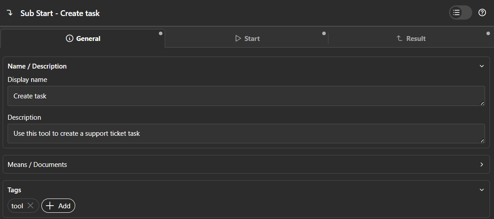

# Defining Tools

AI agents in Smart Workflow use tools to take action. A tool is a named, callable unit of logic that the agent discovers, selects, and invokes at runtime. Smart Workflow supports two kinds of tools.

---

## Callable Process Tools

We strongly encourage using callable subprocesses as tools. This approach aligns naturally with how Ivy developers already work and provides full access to the power of the process designer—such as error handling, dialogs, subprocess calls, and other Axon Ivy capabilities.

You can turn any callable subprocess into a tool by simply adding the `tool` tag.

**Steps:**

1. Create a callable sub-process in your Axon Ivy project.
2. Add the tag `tool` to the process.
3. Write a clear `description` — this is what the agent reads to decide whether to call the tool.



---

## Java Tools

For advanced use cases, tool logic can also be implemented directly in Java. This is rarely needed — prefer callable processes whenever possible. Consider Java Tools only when the logic has no workflow steps and is better expressed as a plain Java class.

### Step 1 — Implement `SmartWorkflowTool`

```java
public class MyTool implements SmartWorkflowTool {

  @Override
  public String name() {
    return "myTool"; // name the agent uses to call this tool
  }

  @Override
  public String description() {
    return "Describe what this tool does and when the agent should use it.";
  }

  @Override
  public List<ToolParameter> parameters() {
    return List.of(
        new ToolParameter("paramName", "description of this param", "java.lang.String")
    );
  }

  @Override
  public Object execute(Map<String, Object> args) {
    String value = (String) args.get("paramName");
    // ... your logic
    return result;
  }
}
```

The type is a string identifying the Java type. The following kinds are supported:

| Kind | Example |
| --- | --- |
| Primitive | `"int"`, `"boolean"`, `"double"` |
| Java class | `"java.lang.String"`, `"com.example.MyClass"` |
| List | `"java.util.List<java.lang.String>"`, `"java.util.List<com.example.MyClass>"` |

Arrays are not supported — use `List` instead.

The framework deserializes the agent's JSON arguments into the declared Java type automatically.

### Step 2 — Create a `SmartWorkflowToolsProvider`

Group one or more tools in a provider class:

```java
public class MyToolProvider implements SmartWorkflowToolsProvider {
  @Override
  public List<SmartWorkflowTool> getTools() {
    return List.of(new MyTool());
  }
}
```

### Step 3 — Register via SPI

Create the file `src/META-INF/services/com.axonivy.utils.smart.workflow.tools.provider.SmartWorkflowToolsProvider` and the tool provider:

```text
com.example.MyToolProvider
```

The framework loads all registered providers at startup.

---

## Demo: TaxCalculatorTool

[`TaxCalculatorTool`](../smart-workflow-demo/src/com/axonivy/utils/smart/workflow/demo/tool/TaxCalculatorTool.java) shows a complete Java Tool that accepts a structured `Invoice` object and returns per-item tax calculations.

Key points from the demo:

- Uses a custom type (`com.axonivy.utils.ai.Invoice`) as a parameter — the framework deserializes it automatically from the agent's JSON call.
- Returns a typed result record (`TaxCalculationResult`) which the framework serializes back to the agent as JSON.
- Registered in [`DemoToolProvider`](../smart-workflow-demo/src/com/axonivy/utils/smart/workflow/demo/tool/DemoToolProvider.java) via SPI.

---

## Standard Tools

Smart Workflow ships with built-in tools that agents can use out of the box.

### webSearch

Searches the web for current information and returns a list of results with titles, URLs, and content snippets.
Agents select this tool automatically when they need up-to-date or factual information from the internet.

**Configuration** (set in `variables.yaml`):

| Variable | Purpose | Default |
| --- | --- | --- |
| `AI.Tool.WebSearch.Engine` | Name of the search engine to use. Must match the `name()` of a registered `SmartWebSearchEngine`. If empty, the first available engine is used. | _(empty — first available)_ |
| `AI.Tool.WebSearch.MaxResults` | Maximum number of search results returned per query | `5` |
| `AI.Tool.WebSearch.WhitelistDomains` | Comma-separated list of allowed domains (e.g. `stackoverflow.com, github.com`). If empty, all domains are allowed. | _(empty — all domains)_ |

**Search engine**: By default the tool uses DuckDuckGo. Custom engines can be plugged in by implementing [`SmartWebSearchEngine`](../smart-workflow/src/com/axonivy/utils/smart/workflow/tools/web/SmartWebSearchEngine.java) and registering a [`SmartWebSearchEngineProvider`](../smart-workflow/src/com/axonivy/utils/smart/workflow/tools/web/SmartWebSearchEngineProvider.java) via SPI.

**Using the tool in a process**: Assign `webSearch` to the `tools` field of an Agentic Process Call element:

```
tools = ["webSearch"]
```

See the [`WebSearchDemo`](../smart-workflow-demo/processes/Features/WebSearchDemo.p.json) process for a complete example.
