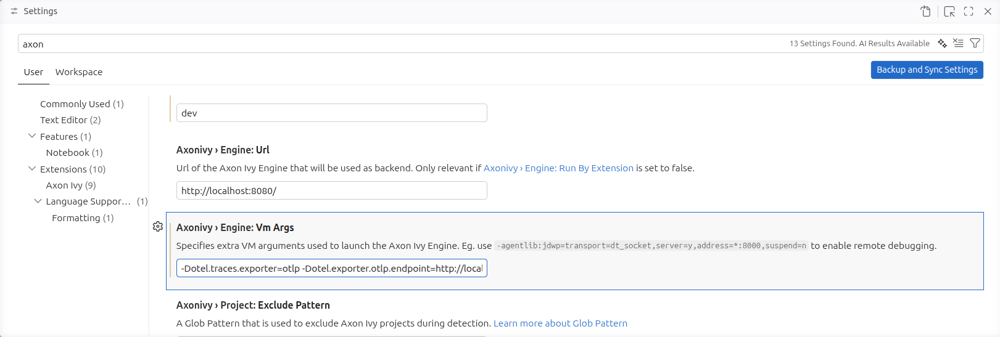

# Observability

In AI-assisted adaptive process initiatives, it's crucial to observe execution paths of the AI agents.
With observation tools you remain in control of spent costs, used models and processed data.

## Tracing with Arize Phoenix

Arize Phoenix is a tracing platform that collects Agent metrics from the Axon Ivy Engine.
It provides a rich user-interface to oversee interactions of the users with AI Models, Tool calls,
Token costs and more. In addition, it allows you to re-play real requests with alternative models or prompts.

### Setup

#### Arize Phoenix

1. Run Arize Phoenix using Docker: `docker run --rm -p 6006:6006 -p 4317:4317 arizephoenix/phoenix:nightly`
2. Visit the tracing platform in your browser [http://localhost:6006](http://localhost:6006)

#### Visual Studio Code

1. Install the Axon Ivy Designer extension
2. Open the Settings and search for Axon Ivy, in it define:
    - `AxonIvy > Engine: VM args` : `-Dotel.traces.exporter=otlp -Dotel.exporter.otlp.endpoint=http://localhost:6006 -Dotel.resource.attributes=openinference.project.name=smart-workflow`
3. Restart Visual Studio Code (Command > Developer: Reload Window)
4. Set the variable `AI.Observability.Openinference.Enabled=true` in the `config/variables.yaml` of a project depending on smart-workflow.
5. Run an AI assisted process in smart-workflow-demo

#### Devcontainer

Our [Devcontainer](../dev/DEVCONTAINER.md) is pre-configured to run Arize Phoenix within your codespace. 
In this alternative dev environment you only need to define the AI Provider API key. 
Processes that you run will automatically report to Arize Phoenix 
and you can inspect the traces on the exposed container port 6006.

### Querying

To query costs, models or prompts from past AI assistant runs open Arize Phoenix in your browser [http://localhost:6006](http://localhost:6006).
1. Click on the "smart-workflow" project
2. Enter filter condition `span_kind == 'LLM'`
3. Switch to from `Root Spans` to `All` next to the filter bar

#### Filters

If you like to dig deeper. Note that it's possible to track AI interactions over a complete Case or Task.
You can reveal them by adding a filter, expressing the UUID of the Case respectively the Task.

- Case with UUID 6407c9bd-be10-4334-9ca9-c9b846fc1f57:

  `span_kind == 'LLM' and ivy.case == '6407c9bd-be10-4334-9ca9-c9b846fc1f57'`

- Task with UUID 2afa6db6-35d6-4f72-af05-711963888b0b:

  `span_kind == 'LLM' and ivy.task == '2afa6db6-35d6-4f72-af05-711963888b0b'`

## AI-assisted Custom Fields

Smart Workflow automatically marks Cases and Tasks with a custom field when an AI agent is invoked during their execution.
This provides a lightweight, built-in way to track AI usage directly on workflow entities without requiring an external tracing platform.

### Custom Field

| Field key    | Type   | Label        | Scope      |
|--------------|--------|--------------|------------|
| `aiAssisted` | STRING | AI-assisted  | Task, Case |

The field is set to `SMART_WORKFLOW` when the AI agent is used within the context of a Task or Case.

### Configuration

The feature is enabled by default. To disable it, set `AI.Observability.CustomFields.Enabled=false` in the `config/variables.yaml` of your project.
