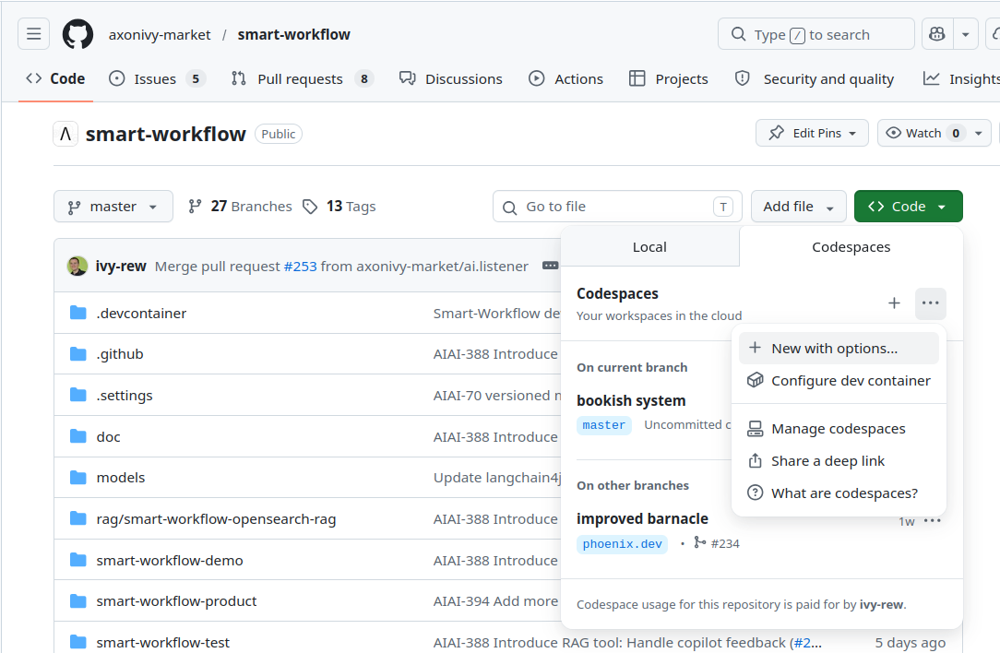

# Dev Container

Our Smart-Workflow development environment is accessible via a Dev Container. The container removes the complexity of setting up your workspace and provides sidecar services like [RAG](../RAG.md) (OpenSearch) or [Tracing](../observe/OBSERVE.md) via third-party tools.

Therefore, the Dev Container is perfect for:
- new users that want to explore the full capabilities of Smart-Workflow
- developers that want to avoid the "runs on my machine" disappointment when going to Q&A and production

## Local machine

Your local machine can run the Smart-Workflow Dev Container with a few simple steps. Locally run, this produces no costs and leverages the power of your hardware.

### Requirements

- Docker must be installed and running (Docker Desktop on macOS/Windows, or Docker Engine on Linux).
- VS Code with the **Dev Containers** extension (`ms-vscode-remote.remote-containers`) is recommended.

### Start locally in VS Code

1. Clone this repository to your machine.
2. Open the repository folder in VS Code.
3. Run **Dev Containers: Reopen in Container** from the command palette.
4. Wait until you see the Axon Ivy Welcome page (this can take a few minutes).
5. Enter your API key in `smart-workflow-test/config/variables.yaml` via Import `AI.Providers.OpenAI.APIKey`.

## GitHub hosted

To run a Smart-Workflow dev environment no local environment is required. You can run it right in the browser, hosted by GitHub.

### How to start

1. Open the repository in GitHub.
2. Click the green **Code** button and open the **Codespaces** tab.
3. Click the `...` menu (or **Configure and create codespace**) to select options before launch.
4. Set the machine type to a **4-core** option.
5. Create the codespace and wait until VS Code starts.
6. Wait until you see the Axon Ivy Welcome page (this can take 5-10 minutes).
7. Enter your API key in `smart-workflow-test/config/variables.yaml`
8. Run a demo from smart-workflow-demos or start developing your feature.

### Cost tip

To avoid unexpected costs, stop your codespace as soon as your session is finished. In GitHub, open the **Codespaces** page and choose **Stop codespace** for inactive environments instead of leaving them running in the background.

### Sidecar services

The Dev Container starts these services automatically:

| Service      | Image                                         | Port   | Purpose                                                                                                                        |
| ------------ | --------------------------------------------- | ------ | ------------------------------------------------------------------------------------------------------------------------------ |
| `workspace`  | `mcr.microsoft.com/devcontainers/base:trixie` | –      | Your VS Code workspace with Java, Maven, and the Axon Ivy engine.                                                              |
| `phoenix`    | `arizephoenix/phoenix:nightly`                | `6006` | OpenInference tracing UI — see [Tracing](../observe/OBSERVE.md).                                                               |
| `opensearch` | `opensearchproject/opensearch:2.11.0`         | `9200` | Vector store for [RAG](../RAG.md). Started with security disabled and `discovery.type=single-node` for local development only. |

> **Note:** OpenSearch memory is capped at 512 MB (`OPENSEARCH_JAVA_OPTS=-Xms512m -Xmx512m`) to keep the dev container lightweight. Raise this value in `.devcontainer/compose.yml` if you ingest large datasets.
