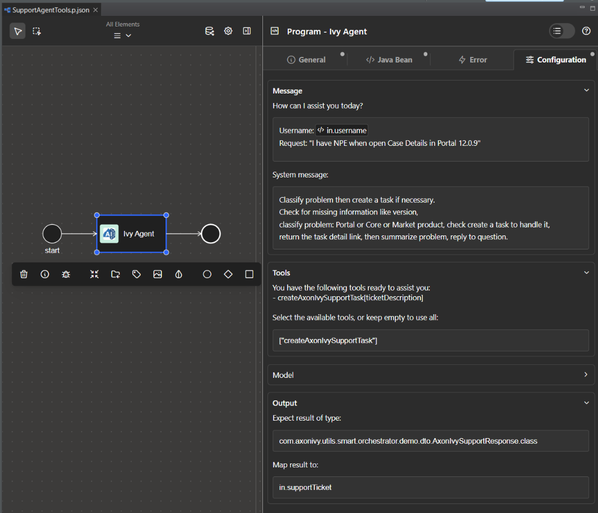
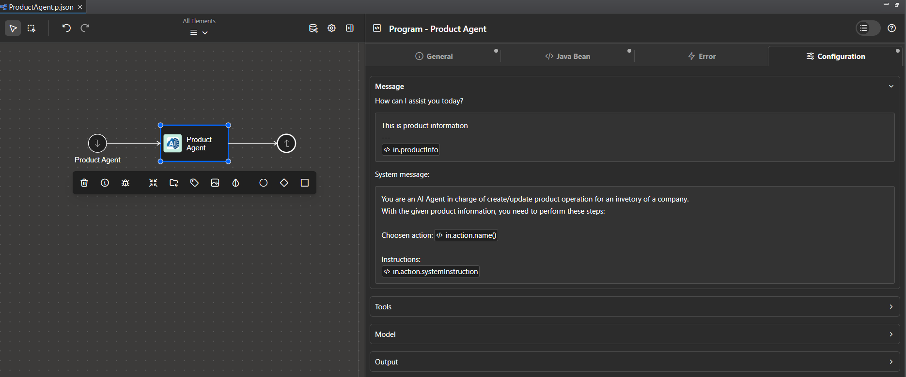

# Intelligenter Workflow

**Die „Smart Workflow** “ integriert KI direkt in Axon Ivy, sodass Entwickler KI-Agenten innerhalb bestehender Axon-Prozesse erstellen, ausführen und optimieren können. Damit können Geschäftsabläufe große Sprachmodelle nutzen, um natürliche Sprache zu verstehen, autonome Entscheidungen zu treffen und sich an veränderte Anforderungen anzupassen – und das alles ohne umfangreiche architektonische Änderungen.

Die wichtigsten Vorteile von Smart Workflow:

- **Bekanntes Setup:** Fügen Sie KI-Agenten ohne strukturelle Änderungen in BPMN-Prozesse ein und konfigurieren Sie alles über die Standardschnittstellen von Axon Ivy.
- **Für den Einsatz in Unternehmen geeignet:** Speziell für die Anforderungen von Unternehmen entwickelt, mit Protokollierung, Überwachung und Konfigurationssteuerung.
- **Flexible Tools:** Verwandeln Sie jeden aufrufbaren Prozess in ein für KI auffindbares Tool.
- **Unterstützung verschiedener Modelle:** Verwenden Sie je nach Aufgabe einfache oder komplexe Modelle.
- **Typsichere Ausgaben:** Erzeugt strukturierte Java-Objekte aus KI-Antworten zur sofortigen Verwendung.
- **Verarbeitung natürlicher Sprache:** Unstrukturierte Eingaben akzeptieren und menschenlesbare Ausgaben zurückgeben.

**Haftungsausschluss**

Der Benutzer von „ **“ ist allein verantwortlich** für die Konfiguration, Bereitstellung und den Betrieb der KI und der zugehörigen Agenten. Alle Entscheidungen, Maßnahmen oder Ergebnisse, die sich aus der Nutzung dieses Konnektors ergeben, liegen vollständig in der Verantwortung des Benutzers.

Wir stellen lediglich die technische Funktion „ **“** zur Verfügung, um solche Konfigurationen zu ermöglichen, und schließen ausdrücklich jegliche Haftung für Missbrauch, Fehlkonfigurationen oder unbeabsichtigte Folgen, die sich aus der Nutzung ergeben, aus. Durch die Nutzung dieses Connectors erkennen Sie diese Einschränkungen an und akzeptieren sie.

## Demo

### Axon Ivy Support Agent – Demo

Diese Demo veranschaulicht die Verwendung des „Axon Ivy Support Agent“, eines KI-gestützten Agenten, der in einen Geschäftsworkflow integriert ist. Der Agent dient dazu, Supportprobleme zu klassifizieren, auf fehlende Informationen zu prüfen und automatisch Supportaufgaben anzulegen.

<details>
<summary><strong>Workflow Overview</strong></summary>

1. **Eingabe:** Der Mitarbeiter erhält eine Support-Anfrage und den Benutzernamen des Anfragenden.
2. **Klassifizierung:** Hier wird das Problem analysiert, festgestellt, ob Informationen fehlen (z. B. die Version), und das Problem klassifiziert (Portal, Core oder Market-Produkt).
3. **Erstellung einer Support-Aufgabe:** Falls erforderlich, erstellt der Mitarbeiter mithilfe des Tools „ `“ unter „createAxonIvySupportTask“` eine Support-Aufgabe und stellt einen Link zu der erstellten Aufgabe bereit.
4. **Zusammenfassung und Antwort:** Der Mitarbeiter fasst das Problem zusammen und gibt dem Nutzer eine ausführliche Antwort.

</details>

<details>
<summary><strong>Technical Details</strong></summary>

- Der Agent ist als aufrufbarer Unterprozess implementiert (`AxonIvySupportAgent.p.json`) und nutzt das Java-Bean „ `com.axonivy.utils.smart.workflow.AgenticProcessCall“`.
- Der Agent ist so konfiguriert, dass er ein bestimmtes Tool verwendet (`createAxonIvySupportTask`), mit dem er automatisch Support-Aufgaben innerhalb des Workflows erstellen kann. Dies wird erreicht, indem der Name des Tools in der Konfiguration des Agenten angegeben wird (siehe Beispiel unten).
- Die Ausgabe des Agenten wird einem strukturierten Java-Objekt zugeordnet (`AxonIvySupportResponse`), wodurch sich das von der KI generierte Ergebnis problemlos direkt in Axon-Ivy-Prozessen verwenden lässt. Dieses Objekt enthält in der Regel Angaben wie die Klassifizierung, den erstellten Aufgabenlink und eine Zusammenfassung des Support-Falls.

</details>

<details>
<summary><strong>Agent Configuration Example</strong></summary>

Um den Agenten zu konfigurieren, definieren Sie ein Programmelement mit den folgenden Einstellungen:



Diese Konfiguration stellt sicher, dass der Agent ausschließlich das angegebene Tool verwendet und dessen Ausgabe als strukturiertes Java-Objekt zurückgibt.

</details>

<details>
<summary><strong>Demo Run Example</strong></summary>

Angenommen, ein Benutzer reicht folgende Supportanfrage ein: „Ich erhalte eine NPE-Fehlermeldung, wenn ich die Falldetails in Portal 12.0.9 öffne.“

1. Der Mitarbeiter erhält die Frage und den Benutzernamen.
2. Es prüft, ob Informationen fehlen (z. B. die Version), stuft das Problem als Portalproblem ein und stellt fest, dass eine Support-Aufgabe angelegt werden sollte.
3. Der Agent ruft das Tool „createAxonIvySupportTask“ unter` der „ `“ auf, das eine neue Support-Aufgabe erstellt und einen Link dazu zurückgibt.
4. Der Mitarbeiter fasst das Problem zusammen und gibt eine Antwort wie beispielsweise:

```text
Klassifizierung: Portal
Zusammenfassung: Das Problem ist eine NullPointerException (NPE), die beim Öffnen der Falldetails in Portal Version 12.0.9 auftritt. Da das Problem mit dem Portal-Produkt zusammenhängt und die Version angegeben wurde, wurde ein Support-Ticket erstellt, um dieses Problem zu beheben.
```

Diese Antwort wird dem Objekt „AxonIvySupportResponse“ (` ) unter `zugeordnet und kann direkt in nachfolgenden Workflow-Schritten verwendet werden.

</details>

<details>
<summary><strong>How to Run the Demo</strong></summary>

1. Stellen Sie sicher, dass Sie den Abschnitt [Konfigurationen](#configurations) ausgefüllt haben.
2. Starten Sie den Prozess unter **Axon Ivy Support** mit einer Support-Anfrage und Ihrem Benutzernamen.
3. Sehen Sie sich die Antwort des Bearbeiters an, die die Klassifizierung, die Erstellung einer Aufgabe (falls erforderlich) und eine Zusammenfassung enthält.

</details>

---

### Einkaufs-Demo

Diese Demo zeigt, wie KI die Abläufe eines kleinen E-Commerce-Modeshops verändern kann. Sie ist etwas fortgeschrittener und kombiniert zwei Mini-Demos: eine zur Produkterstellung und eine zur semantischen Suche. Aufgrund ihrer Komplexität werden wir hier nicht näher auf den Code oder eine Schritt-für-Schritt-Anleitung eingehen. Wenn Sie sich die Umsetzung genauer ansehen möchten, schauen Sie sich bitte das Demo-Projekt unter `smart-workflow-demo` an.

<details>
<summary><strong>Product creation</strong></summary>

Bisher musste der Ladenbetreiber beim Hinzufügen eines Produkts viele Felder manuell ausfüllen und abhängige Datensätze (Lieferant, Marke, Kategorie) überprüfen oder anlegen. Für einen kleinen Laden kann dieser Vorgang Stunden oder sogar einen ganzen Tag in Anspruch nehmen: manuelle Dateneingabe, Suche nach fehlenden Informationen und erneute Überprüfung auf Fehler.

Mit den Smart-Workflow-Agenten importiert der Bediener lediglich die Produktspezifikation und die Bilddateien. Die Agenten übernehmen das Parsen, die Validierung, die Auflösung von Abhängigkeiten und die Produkterstellung – wodurch der manuelle Aufwand und die Zeit bis zur Veröffentlichung erheblich reduziert werden.

Entwickler müssen vier Agenten erstellen

1. Produktvertreter

- Eingabe: analysierte Produktspezifikation
- Werkzeuge:
  - Produkt suchen: Produkt im System suchen
  - Produkt anlegen: Ein neues Produkt anhand der angegebenen Spezifikation anlegen
  - Produktabhängigkeiten prüfen: Andere Mitarbeiter hinzuziehen, um Abhängigkeiten (Lieferant, Marke und Kategorie) zu ermitteln und zu überprüfen

2. Lieferantenvertreter

- Eingabe: Lieferantenangaben
- Werkzeuge:
  - Lieferanten suchen: Lieferanten im System suchen
  - Lieferanten anlegen: Legen Sie anhand der angegebenen Informationen einen neuen Lieferanten an

3. Kategorie: Makler

- Eingabe: Informationen zur Produktkategorie
- Werkzeuge:
  - Kategorie suchen: Kategorie im System suchen
  - Kategorie erstellen: Erstellen Sie anhand der angegebenen Informationen eine neue Kategorie.

4. Markenvertreter

- Eingabe: Informationen zur Produktmarke
- Werkzeuge:
  - Marke suchen: Marke im System suchen
  - Marke anlegen: Legen Sie anhand der bereitgestellten Informationen eine neue Marke an

Ablauf der Demo (Start- **, „Neues Produkt erstellen“** -Prozess)

1. Der Betreiber lädt Produktspezifikationen und Bilddateien hoch.
2. Smart Workflow analysiert die Dateien und extrahiert Produktattribute (Titel, Artikelnummer, Beschreibung, Preis, Lieferantenangaben, Marke, Kategorie, Bilder).
3. Validatoren überprüfen die Semantik und die Einschränkungen (Pflichtfelder, Formate, Eindeutigkeit der SKU, Bildanforderungen).
4. Für jede Abhängigkeit (Lieferant, Marke, Kategorie) fragt Smart Workflow den zuständigen Mitarbeiter: Wenn die Entität existiert → die ID zurückgeben, wenn sie fehlt → sie anhand der bereitgestellten Spezifikation anlegen.
5. Der Produktbeauftragte legt das Produkt mit validierten Attributen und Verknüpfungen zu Abhängigkeits-IDs an.
6. Das System gibt eine Zusammenfassung aus und öffnet optional einen Bildschirm zur manuellen Überprüfung mit vorausgefüllten Feldern für die endgültige Freigabe.

Der neue KI-gestützte Prozess führte zu weniger Fehlern, deutlich weniger manuellem Aufwand und einer wesentlich kürzeren Zeit bis zur Veröffentlichung.

</details>

<details>
<summary><strong>Semantic search</strong></summary>

Vor dem Zeitalter der KI gaben Käufer Suchbegriffe wie „rotes Kleid“ ein, wendeten dann manuell Filter (Preis, Marke, Kategorie) an und durchsuchten die Ergebnisse. Dieser Vorgang war nicht nur langsam und unflexibel, sondern erfasste oft auch keine Synonyme, Stile oder Absichten (z. B. „Party“ vs. „Arbeit“).

Bei der semantischen Suche gibt der Nutzer eine natürliche Anfrage per Sprache oder Tastatur ein. Die KI erkennt die Absicht und die Rahmenbedingungen (Farbe, Preis, Anlass, Dringlichkeit) und wandelt diese in ein strukturiertes Kriterienobjekt um. Das Backend wandelt dieses Objekt anschließend in SQL-Prädikate um und liefert passende Ergebnisse. Bietet klare Erklärungen, vertraute Tools und eine einfachere Implementierung.

Entwickler müssen dem Produkt-Agenten „ `“ (` ) ein zusätzliches Tool namens „ `“ („Produkt nach Kriterien suchen“;` ) hinzufügen, wobei die Suchkriterien als Eingabe dienen.

Ablauf der Demo (Start- **-Shopping-Store-** -Prozess)

1. Kunde: tippt oder sagt: „Ich brauche ein rotes Kleid für 100 Dollar für eine Party heute Abend.“
2. `Der Produktagent` extrahiert Attribute und erweitert die Suchanfrage (Synonyme, akzeptable Preisspanne: 80–120 Dollar).
3. Axon Ivy Business Data wandelt Kriterien in optimierte Filter und Suchfunktionen für die Produkte um.
4. Gib die besten Produkte zurück, die den Kriterien entsprechen.

Um die Demodaten schnell einzurichten, starten Sie „ **“ und wählen Sie aus der Prozessliste „Daten für Shopping-Demo erstellen“ (** ) aus.

</details>

---

### Demo zur Dateiextraktion

Diese Demo zeigt, wie man einen Prozess erstellt, der Rechnungsdaten direkt aus hochgeladenen Bildern und PDF-Dateien ausliest – ganz ohne manuelle Dateneingabe. Mithilfe multimodaler Sprachmodelle liest die KI den Dokumentinhalt aus und gibt strukturierte Java-Objekte zurück, die in den nachfolgenden Prozessschritten sofort verwendet werden können.

Um Daten aus einer Datei zu extrahieren, fügen Sie den Dateiinhalt in die Benutzermeldung des Agenten ein. Die KI liest diesen Inhalt und ordnet das Ergebnis der angegebenen Java-Klasse zu – es sind weder spezielle Tools noch Zugriff auf das Dateisystem erforderlich.

<details>
<summary><strong>Demo flow</strong></summary>

- Starten Sie die Demo zur Dateiextraktion „ **“ (CMS) unter** oder die Demo zur Dateiextraktion „ **“ (Binär) unter** aus der Prozessliste.

  1. Der Prozess lädt ein Rechnungsbild und eine PDF-Datei.
  2. Der Inhalt der Datei ist in der Benutzernachricht des Agenten enthalten.
  3. Die KI liest die Rechnungsfelder aus und extrahiert sie.
  4. Das Ergebnis wird als typisiertes Java-Objekt zurückgegeben, das für den nächsten Prozessschritt bereitsteht.

</details>

Nicht alle Anbieter unterstützen multimodale Eingaben – eine Übersicht über die unterstützten Anbieter und Dateiformate finden Sie in den [Richtlinien für Modellbeiträge](../doc/MODELS.md#file-extraction-support).

---

### Leitplanken-Demonstration

Diese Demo zeigt, wie integrierte Smart-Workflow-Sicherheitsvorkehrungen KI-Agenten vor Prompt-Injection-Angriffen schützen und verhindern, dass sensible Daten in KI-Antworten preisgegeben werden. Ohne diesen Schutz könnte ein böswilliger Nutzer eine Nachricht verfassen, die die Systemaufforderung überschreibt oder den Agenten dazu verleitet, interne Daten preiszugeben.

In den Feldern „ `“, „inputGuardrails“` / `und „outputGuardrails“` des Agenten sind zwei Schutzebenen konfiguriert:

- `PromptInjectionInputGuardrail` — überprüft Benutzereingaben, bevor sie das KI-Modell erreichen, und blockiert bekannte Injektionsmuster
- `SensitiveDataOutputGuardrail` — überprüft die KI-Antwort, bevor sie zurückgegeben wird, und blockiert Ausgaben, die API-Schlüssel oder private Schlüssel enthalten

Standard-Guardrails können global in der Datei „variables.yaml“ unter `` unter `AI.Guardrails.DefaultInput` und `AI.Guardrails.DefaultOutput` festgelegt werden – jeder Agent ohne explizite Guardrails übernimmt diese Standardwerte.

<details>
<summary><strong>Demo flow</strong></summary>

- **Demo zur Prompt-Injection-** (Start: **Prompt-Injection-Guardrail-Demo:** process)

  1. Eine gezielt gestaltete bösartige Nachricht wird übermittelt. Der „ `“ PromptInjectionInputGuardrail` fängt diese ab, bevor die KI aufgerufen wird, und löst einen Fehler aus.
  2. Der Prozess erfasst den Fehler über ein „ `“-ErrorBoundaryEvent` und leitet ihn an einen sicheren Fallback-Pfad weiter.

- **** für die Ausgabe sensibler Daten (Start- -Demo zum Schutzmechanismus für die Ausgabe sensibler Daten process) ****

  1. Eine Nachricht weist den Agenten an, sensible Daten in seine Antwort aufzunehmen. Der „ `“ „SensitiveDataOutputGuardrail“` fängt die Antwort ab, nachdem das Modell sie zurückgegeben hat, und blockiert sie.
  2. Die Fehlergrenze erkennt diesen Verstoß und leitet den Ablauf wieder auf den sicheren Ausweichpfad um.

</details>

---

### Demo zu maßgefertigten Leitplanken

Diese Demo zeigt, wie eine domänenspezifische Geschäftsregel als wiederverwendbares benutzerdefiniertes Guardrail implementiert und registriert wird. Eine Unternehmensrichtlinie schreibt vor, dass Agenten niemals Produkte von Wettbewerbern erwähnen dürfen. Das Guardrail „ `“ (BlockCompetitorMentionGuardrail,` ) setzt diese Regel an einer zentralen Stelle durch – sobald es registriert ist, kann es jedem Agenten namentlich zugewiesen werden, ohne dass einzelne Systemaufforderungen geändert werden müssen.

Entwickler implementieren „ `“ (SmartWorkflowInputGuardrail)`, stellen es über einen „ `“ (GuardrailProvider)` bereit und registrieren den Provider unter `META-INF/services/com.axonivy.utils.smart.workflow.guardrails.provider.GuardrailProvider`. Der Name des Guardrails erscheint dann automatisch in der Liste „Verfügbare Eingabe-Guardrails“. Jeder Agent aktiviert die Funktion über `inputGuardrails: ["BlockCompetitorMentionGuardrail"]`; um sie auf alle Agenten anzuwenden, fügen Sie sie unter `AI.Guardrails.DefaultInput` in der Datei `variables.yaml` hinzu.

<details>
<summary><strong>Demo flow</strong></summary>

- **Blockierte Abfrage** (Start- **-Demo zu „Custom Guardrail“ – Blockierter Prozess** )

  1. Ein Nutzer gibt eine Suchanfrage ein, in der ein Produkt eines Mitbewerbers erwähnt wird.
  2. `BlockCompetitorMentionGuardrail` erkennt die Erwähnung und blockiert die Anfrage, bevor das KI-Modell aufgerufen wird.
  3. Der Prozess erkennt den Fehler und leitet den Ablauf auf einen sicheren Ausweichpfad um.

- **Zulässige Abfrage** (Start- **-Demo zu „Custom Guardrail“ – Zulässiger** -Prozess)

  1. Ein Nutzer gibt eine Suchanfrage ein, in der keine Wettbewerber erwähnt werden.
  2. `BlockCompetitorMentionGuardrail` findet nichts, was blockiert werden müsste, und lässt die Anfrage durch.
  3. Der Agent bearbeitet die Anfrage und antwortet wie gewohnt.

</details>

---

## Bewährte Verfahren

Die folgenden Demos veranschaulichen die Best Practices von „ **“ (** ) zur Strukturierung von Axon Ivy-Agenten und -Tools mit Smart Workflow. Es werden drei sich ergänzende Muster gezeigt: eines zur strengen Begrenzung des Tool-Zugriffs eines Agenten, eines zur linearen, aufgabenbasierten Orchestrierung und eines zur Wiederverwendung von Tools in Funktionsgruppen.

### Agenten-Pipeline

Eine lineare Kette von Agenten, in der jeder einzelne eine Eingabe verarbeitet und das Ergebnis an die nächste Stufe weiterleitet. Bewährte Vorgehensweise: Weisen Sie jedem Agenten eine eigene Aufgabe zu, damit die Ausführung nachverfolgt werden kann, fortgesetzt werden kann und im Aufgabenverlauf sichtbar ist.

Sehen Sie sich die Demo zur „ **-Agent-Pipeline“ unter** sowie den Prozess unter `smart-workflow-demo` an.

### Eigenständiger Agent mit integrierten Tools

Der Agent und seine Tools sind in einer einzigen Datei enthalten, die keine prozessübergreifenden Verweise enthält, sodass die gesamte Funktionalität problemlos als eine einzige aufrufbare Schnittstelle bereitgestellt und zugänglich gemacht werden kann.

Siehe den Prozess „ **: Self-Contained Agent“ (** ) unter `smart-workflow-demo`.

### Nach Funktionen gruppierte Agenten und Tools

Dieses Muster zeigt, wie Agenten und Tools nach Geschäftsbereichen organisiert werden können, wenn Tools von mehreren Agenten gemeinsam genutzt werden sollen. Anstatt alles in einem einzigen aufrufbaren Objekt zu bündeln, befinden sich jeder Agent und jede Tool-Gruppe in einer eigenen Prozessdatei unter einem gemeinsamen Feature-Ordner – wodurch die Bereichsgrenzen deutlich gemacht werden und die Wiederverwendung von Tools ermöglicht wird.

Sehen Sie sich die „ **“-Shopping-Demo unter** sowie den Prozess unter `smart-workflow-demo` an.

## Einrichtung

Um Ihre KI-Initiative auf den Weg zu bringen, müssen wir die Modelle und Tools im Vorfeld festlegen.

### Modelle

Smart Workflow ist nicht an einen bestimmten KI-Anbieter gebunden. Sie können bei der Installation Ihre bevorzugten Modellanbieter auswählen.

Bitte wählen Sie nach der Installation Ihren Standard-Modellanbieter aus.

Die Auswahl Ihres Anbieters erfolgt über die Variable „ `“ AI.DefaultProvider`. Darüber hinaus benötigen die meisten Modellanbieter einen API-Schlüssel oder eine andere eindeutige Kennung. Überprüfen Sie unten Ihren Anbieter, um zu sehen, welche Variablen zusätzlich gesetzt werden müssen.

Um Unterstützung für weitere Anbieter von KI-Modellen anzufordern, eröffnen Sie bitte ein Issue oder reichen Sie einen Pull Request auf GitHub ein. Beachten Sie bei Ihren Beiträgen unbedingt die [Richtlinien für Modellbeiträge](../doc/MODELS.md), damit Ihr Anbieter mit dem Smart-Workflow-Ökosystem kompatibel bleibt.

```yaml
@variables.yaml@
```

#### OpenAI-Modelle

<details>

<summary>OpenAI setup instructions</summary>
OpenAI models are natively supported. If you wish to use them import the `smart-workflow-openai` project and define your OpenAI key.

```yaml
@variables.openai@
```
</details>

#### Azure OpenAI-Modelle

<details>

<summary>Azure OpenAI setup instructions</summary>
Azure OpenAI models are supported. To use Azure OpenAI, import the `smart-workflow-azure-openai` project and configure your Azure OpenAI endpoint and deployments.

Jede Bereitstellung in Azure OpenAI entspricht einer Modellinstanz mit einem eigenen API-Schlüssel. Sie können mehrere Bereitstellungen so konfigurieren, dass für verschiedene Aufgaben unterschiedliche Modelle verwendet werden.

```yaml
@variables.azureopenai@
```

Beispielkonfiguration:

```yaml
@variables.azureopenai.example@
```
</details>

#### Google Gemini-Modelle

<details>

<summary>Google Gemini setup instructions</summary>
Google Gemini models are supported. To use Google Gemini, import the `smart-workflow-gemini` project and configure your Gemini API key and default model.
This provider does not support the structured output feature because Google Gemini models do not support structured JSON responses.

```yaml
@variables.gemini@
```

Beispielkonfiguration:

```yaml
@variables.gemini.example@
```
</details>

#### x.AI-Modelle

<details>

<summary>x.AI setup instructions</summary>
x.AI models are supported, import the `smart-workflow-xai` to work with these.

```yaml
@variables.xai@
```

Beispielkonfiguration:

```yaml
@variables.xai.example@
```

</details>

#### Anthropische Modelle

<details>

<summary>Anthropic setup instructions</summary>
Claude models (including Claude Opus, Sonnet and Haiku) from Anthropic are supported. Import the `smart-workflow-anthropic` project, configure your API key to get started.

> **Hinweis:** Strukturierte Ausgaben werden nur von Claude Opus 4.6, Claude Sonnet 4.6, Claude Sonnet 4.5, Claude Opus 4.5 und Claude Haiku 4.5 unterstützt. Ältere Modelle (z. B. Claude Sonnet 4, Claude Opus 4) unterstützen diese Funktion nicht.

```yaml
@variables.anthropic@
```

Beispielkonfiguration:

```yaml
@variables.anthropic.example@
```

</details>

#### Ollama-Modelle

<details>

<summary>Ollama setup instructions</summary>
Ollama lets you run open-source models (Llama, Gemma, Qwen, Mistral, ...) locally or on your own infrastructure. Import the `smart-workflow-ollama` project, install [Ollama](https://ollama.com/), and pull the model you want to use (e.g. `ollama pull llama3.2`).

Konfigurieren Sie die BaseUrl `` Ihres Ollama-Servers (Standardwert: `http://localhost:11434`) und das DefaultModel `` . Es ist kein API-Schlüssel erforderlich.

> **Hinweis:** Die Unterstützung für strukturierte Ausgaben hängt vom zugrunde liegenden Modell ab. Neuere Modelle (Llama 3.1+, Gemma 3, Qwen 3, Mistral Nemo, …) können auf Ollama 0.3.0+ Antworten zurückgeben, die den Einschränkungen des JSON-Schemas entsprechen. Ältere oder kleinere Modelle geben möglicherweise Text in freier Form zurück, wodurch die strukturierte Extraktion nicht mehr funktioniert.

> **Hinweis zu Embeddings:** Laden Sie ein spezielles Embedding-Modell herunter, z. B. `nomic-embed-text,` oder `mxbai-embed-large,`, und legen Sie es als `DefaultEmbeddingModel fest,`, um die RAG-Funktionen mit Ollama zu nutzen.

```yaml
@variables.ollama@
```

Beispielkonfiguration:

```yaml
@variables.ollama.example@
```

</details>

### Dateiextraktion

Axon Ivy Smart Workflow unterstützt die Extraktion von Inhalten aus PDF- und Bilddateien (PNG, JPG und JPEG) mithilfe multimodaler LLMs. Dadurch können KI-Agenten hochgeladene Dokumente und Bilder direkt in Ihren Workflows lesen und auswerten.

Nicht alle Anbieter und Modelle unterstützen multimodale Eingaben. Eine vollständige Liste der unterstützten Anbieter und Dateiformate finden Sie in den [Richtlinien für Modellbeiträge](../doc/MODELS.md#file-extraction-support).

### Leitplanken

Sicherheitsvorkehrungen schützen KI-Agenten, indem sie Benutzereingaben validieren, bevor diese das Modell erreichen, und die Modellausgaben überprüfen, bevor sie verwendet werden. Smart Workflow umfasst die folgenden integrierten Sicherheitsvorkehrungen:

| Leitplanke                                       | Typ     | Beschreibung                                                            |
| ------------------------------------------------ | ------- | ----------------------------------------------------------------------- |
| `PromptInjectionInputGuardrail`                  | Eingabe | Verhindert gängige Angriffe durch das Einschleusen von Befehlen         |
| `Schutzmaßnahme für die Ausgabe sensibler Daten` | Ausgabe | Blockiert Antworten, die API-Schlüssel oder private Schlüssel enthalten |

#### Standard-Sicherheitsgrenzen konfigurieren

Legen Sie Standard-Guardrails in der Datei „variables.yaml“ unter „ `“ fest:`:

```yaml
Variablen:
  AI:
    Guardrails:
      # Durch Kommas getrennte Liste von Guardrail-Namen
      DefaultInput: PromptInjectionInputGuardrail
      DefaultOutput: SensitiveDataOutputGuardrail
```

#### Verwendung von Guardrails in Agenten

Geben Sie in der Agentenkonfiguration die Guardrails als String-Array an:

```java
// Eingabe-Sicherheitsgrenzen
["PromptInjectionInputGuardrail", "MyCustomInputGuardrail"]

// Ausgabe-Sicherheitsgrenzen
["SensitiveDataOutputGuardrail", "MyCustomOutputGuardrail"]
```

Wenn keine Guardrails angegeben sind, verwendet der Agent die Standard-Guardrails aus der Datei „variables.yaml“ unter `` .

Mit Smart Workflow können Sie außerdem benutzerdefinierte Sicherheitsvorkehrungen implementieren und Fehler im Zusammenhang mit diesen Sicherheitsvorkehrungen behandeln. Weitere Informationen finden Sie in den [Richtlinien zu Sicherheitsvorkehrungen](../doc/GUARDRAILS.md).

### Werkzeuge definieren

Um effektiv arbeiten zu können, benötigen KI-Agenten Werkzeuge zur Ausführung von Aufgaben. Smart Workflow unterstützt zwei Arten von Werkzeugen: **Aufrufbare Prozess-Werkzeuge** (jeder mit einem Tag versehene aufrufbare Teilprozess) und **Java-Werkzeuge** (Implementierung von `SmartWorkflowTool` und Registrierung über SPI).

Eine Schritt-für-Schritt-Anleitung zur Erstellung beider Tool-Typen finden Sie im [Tools-Leitfaden](../doc/TOOLS.md).

### Definition eines KI-Agenten

Um einen KI-Agenten zu definieren, erstellen Sie ein Programmelement, das auf dem Java-Bean „ `com.axonivy.utils.smart.workflow.AgenticProcessCall` “ basiert. Auf der Registerkarte „ `“ unter „Configuration“` können Sie auf detaillierte Einstellungen für Ihren KI-Agenten zugreifen und diese anpassen.

#### Nachricht

Im Abschnitt „ `-Meldung“ (` ) können Sie die Benutzer- und Systemmeldung für den Agenten festlegen. Da Smart Workflow die direkte Einfügung von Code in diese Felder ermöglicht, bietet es Entwicklern eine bequeme Möglichkeit, Meldungen zu definieren, bevor diese an den KI-Dienst gesendet werden.



#### Werkzeuge

Unterhalb des Abschnitts „ `-Meldungen“ (` ) befindet sich der Abschnitt „ `-Tools“ (` ), in dem Sie die vom Agenten zu verwendenden Tools als String-Array definieren können. Beispiel:

```java
["Produkt suchen", "Produkt anlegen", "Produktabhängigkeiten prüfen", "Suchkriterien für Produkt anlegen"]
```

Wenn standardmäßig keine Tools angegeben werden, geht Smart Workflow davon aus, dass der Agent alle verfügbaren Tools nutzen kann. Daher wird empfohlen, für jeden Agenten einen bestimmten Satz an Tools festzulegen, um die Reaktionsgeschwindigkeit zu verbessern und die Verwendung ungeeigneter Tools zu verhindern.

#### Modell

Nicht alle KI-Agenten sind gleich. Bei Axon Ivy sind wir uns bewusst, dass KI-Agenten Aufgaben unterschiedlicher Komplexität bewältigen. Einige Agenten führen einfache Aufgaben aus, wie beispielsweise das Erstellen von Urlaubsanträgen oder das Erfassen von Benutzerdaten, während andere Datenbanken nach Produkten durchsuchen und Abhängigkeiten wie Lieferanten und Marken bewerten müssen. Daher ermöglicht „Smart Workflow“ Entwicklern, das zugrunde liegende KI-Modell je nach Anwendungsfall auszuwählen.

Geben Sie dazu einfach das gewünschte KI-Modell im Abschnitt „ `-Modell“` ein. Wenn kein Modell angegeben wird, verwendet Smart Workflow standardmäßig das Modell, das in der Variablen „ `AI.OpenAI.Model“` definiert ist.

#### Ausgabe

Bei KI-Anwendungen auf Unternehmensebene ist es üblich, dass das Ergebnis des KI-Agenten in Form eines nutzbaren Objekts benötigt wird. Um diesem Bedarf gerecht zu werden, kann der Smart Workflow-KI-Agent Ergebnisse als Java-Objekt ausgeben, das direkt von Axon Ivy-Prozessen verwendet werden kann.

Sie können dies ganz einfach konfigurieren, indem Sie im Abschnitt „ `-Ausgabe“ (` ) sowohl den erwarteten Ergebnistyp als auch das Zielobjekt angeben, dem das Ergebnis zugeordnet werden soll.


